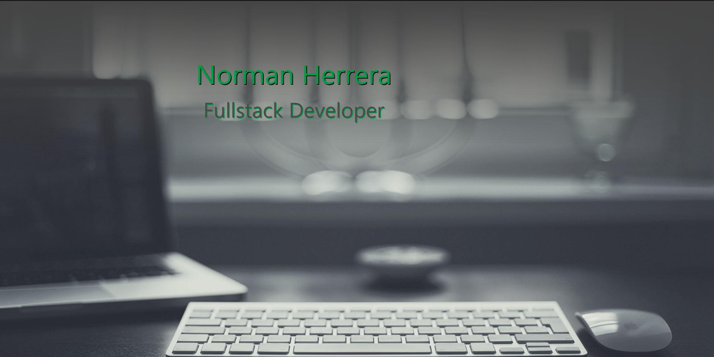

# My new Portfolio

## License

https://opensource.org/licenses/Apache-2.0

## Table of contents

- [Deployed Application](#Deployment)
- [Description](#description)
- [Installation](#installation)
- [Usage](#usage)
- [Contribution Guidelines](#contribution-guidelines)
- [Test](#test)
- [Questions](#questions)
  - [GitHub](#github)
  - [email](#email)

## Deployment

[Github Pages](https://norher.github.io/New-Portfolio/)

## Description

This portfolio showcases some of my latest projects, which include back end projects and a full stack application

## Installation

N/A

## Usage

Let a future employer know about my skills

## Contribution Guidelines

N/A

## Test

N/A

## Questions

### [norher](https://github.com/norher)

### normanh.dev@gmail.com
